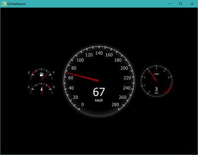

# Node.js 3D QML

This is a part of [Node3D](https://github.com/node-3d) project.

[](https://www.npmjs.com/package/3d-qml-raub)

[](https://travis-ci.com/node-3d/3d-qml-raub)
[](https://www.codefactor.io/repository/github/node-3d/3d-qml-raub)

> npm i -s 3d-qml-raub


## Synopsis

QML 2D graphics plugin for Node.js 3D Core



> Note: compilation tools must be in place on your system.
For Windows, use **ADMIN PRIVELEGED** command line:
\`npm i -g windows-build-tools\`.
Also **Windows** needs **vcredist 2013** to be installed.


## Usage

As any Node3D plugin, `3d-qml-raub` exports a single function. Given a Node3D
object this function extends with `qml` property. Now this property holds
whatever this plugin offers.

See [examples](examples) for more details.

> Note: **IMPORTANT**, using QML, keep in mind it has its own OpenGL context, so
when you use yours, be aware it might be not the current one.
Use `document.makeCurrent()` or `release()` (see exported below).


---

First, import/init the plugin:

```
const core3d = require('3d-core-raub');
const qml3d = require('3d-qml-raub');

qml3d(core3d);

const { three, qml, Image, doc, three } = core3d;
const { Material, Overlay, OverlayMaterial, Rect } = qml;

// ...
```


---

Use QML view as screen-size overlay like this:

```
const ui = new View({ width: screen.w, height: screen.h, file: `${__dirname}/qml/gui.qml` });

doc.on('mousedown', ui.mousedown.bind(ui));
doc.on('mouseup', ui.mouseup.bind(ui));
doc.on('mousemove', ui.mousemove.bind(ui));
doc.on('keydown', ui.keydown.bind(ui));
doc.on('keyup', ui.keyup.bind(ui));
doc.on('wheel', ui.wheel.bind(ui));

new Overlay({ screen, view: ui });
```

This way you can run [real Qt examples](https://doc.qt.io/qt-5.11/qtquick-codesamples.html).
One such example - [Dashboard](https://doc.qt.io/qt-5/qtquickextras-dashboard-example.html)
was [copied](examples/qt-dashboard) from Qt instalation as a proof of concept.

---

You can also extract the texture from a view:

```
// If the view already has some texture - use it
mesh.material.texture = view.textureId !== undefined ?
	three.Texture.fromId(view.textureId, renderer) :
	null;

// If the view creates a new texture - update the material
ui.on('reset', texId => {
	
	release();
	
	mesh.material.texture = texId !== undefined ?
		three.Texture.fromId(texId, renderer) :
		null;
	
});
```

It can be used to create your own overlay or even to texture a scene-space object.
This is actually demonstrated in [scene-space example](examples/scene-space).


## Exports

See docs of [qml-raub](https://github.com/node-3d/qml-raub). This plugin
reexports those as is.

Additionally there are few classes specific for this plugin:
* `Rect` - scene-space Three.js rectangle designed to display QML GUI.
* `Material` - Three.js material for scene-space texturing with QML GUI.
* `Overlay` - fullscreen Three.js overlay to display QML GUI.
* `OverlayMaterial` - Three.js material for fullscreen overlay with QML GUI.
* `release()` - switch OpenGL context to that of the default `document`.
