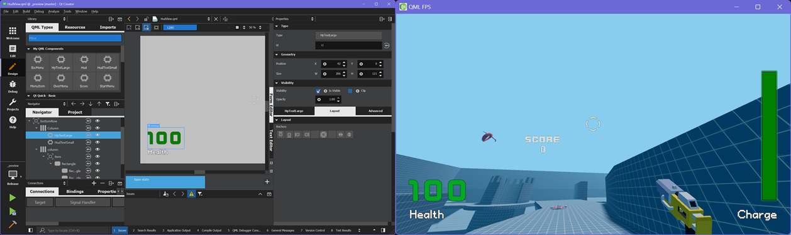

# Node.js 3D QML Helpers

This is a part of [Node3D](https://github.com/node-3d) project.

[](https://badge.fury.io/js/@node-3d/plugin-qml)
[](https://github.com/node-3d/plugin-qml/actions/workflows/lint.yml)
[](https://github.com/node-3d/plugin-qml/actions/workflows/test.yml)

```console
npm install @node-3d/plugin-qml
```

[QML](https://doc.qt.io/qt-6/qmlapplications.html)-rendering helpers for Node.js 3D Core.
The QML backend is **Qt 6.8.0**.



> Note: **IMPORTANT**, QML has its own OpenGL context. Make sure to switch back.
Use `document.makeCurrent()` or `release()` (see exported below).

```typescript
import * as three from 'three';
import { init, addThreeHelpers } from '@node-3d/core';
import { init as initQml } from '@node-3d/plugin-qml';

// Standard Node3D init
const {
	doc, Image: Img, gl,
} = init({
	isGles3: true, isWebGL2: true, autoEsc: true,
});
addThreeHelpers(three);

// Initialize QML and fetch the helpers
const {
	QmlOverlay, Property, Method, View, loop, release, textureFromId,
} = initQml({
	doc, gl, cwd: import.meta.dirname, three,
});
```

* See [example](/examples/fps/main.ts) for a complete setup.

## API

### `init(opts): TQml3D`

Initializes QML rendering for a Node3D document and returns a cached object.
Required options:

* `doc` - the `@node-3d/core` document.
* `gl` - the WebGL/OpenGL API from `@node-3d/core`.
* `three` - the Three.js module instance.
* `cwd` - base directory for QML files. Defaults to `process.cwd()`.

Returned helpers:

* `View`, `Property`, `Method` - re-exported from `@node-3d/qml`.
* `release()` - switches the active OpenGL context back to the Node3D document.
* `loop(cb)` - updates QML, restores the document context, then runs `cb` every frame.
* `textureFromId(id, renderer)` - wraps a QML texture ID as a Three.js `Texture`.
* `QmlMaterial`, `QmlOverlayMaterial`, `QmlOverlay` - Three.js integration classes.

### `QmlOverlay`

Loads a QML view and exposes a Three.js mesh intended for full-screen overlays.
Add `overlay.mesh` to your scene, then listen to events emitted from QML via `eventEmit`.

### `QmlMaterial` and `QmlOverlayMaterial`

Materials that use a QML `View` as their texture source. Use them when QML should appear
on arbitrary meshes or overlay planes.

It is also possible to run [QtQuick examples](https://doc.qt.io/qt-6/qtquick-codesamples.html)
on Node.js with this renderer. But it will only work with `QtQuick` components, i.e.
not `QtMultimedia`, `QtNetwork`, etc. - because those libs are not included.
See [Dashboard](https://doc.qt.io/qt-5/qtquickextras-dashboard-example.html)
example being [copied](examples/qt-dashboard) as a proof of concept.


## QmlOverlay

A common use-case is full-screen overlay UI:

```typescript
// Loads QML and creates all threejs-related resources, e.g. `overlay.mesh` is `THREE.Mesh`
const overlay = new QmlOverlay({ file: `${import.meta.dirname}/qml/Test.qml` });
scene.add(overlay.mesh);

// QML property access shortcut
const propTest = new Property<string>({
	view: overlay, name: 'hud', key: 'testProp',
});

// A typed callable example
type TMethodTest = (arg0: number) => void;
const methodTest: TMethodTest = new Method({
	view: overlay, name: 'hud', key: 'testMethod',
});

// Listen to a user-defined event (could be any other name)
overlay.on('custom-event', (event) => {
	release();
	if (event.button === 'test') {
		console.log('test');
	}
	if (event.button === 'quit') {
		process.exit(0)
	}
});

propTest.value = 'test';
methodTest(123);
```

See [examples](examples) for more details.


## Any Material

Creating a threejs `Texture` from QML `View` is also supported.
Such textures may be used in arbitrary threejs materials of your choice.

```js
const testView = new View({ file: `${import.meta.dirname}/qml/Test.qml` });
const materialTest = new three.SpriteMaterial();

// If the view already has some texture - use it
materialTest.map = textureFromId(testView.textureId, renderer);

// If the view creates a new texture - update the material
testView.on('reset', (textureId) => {
	release();
	materialTest.map = textureFromId(textureId, renderer);
});
```
